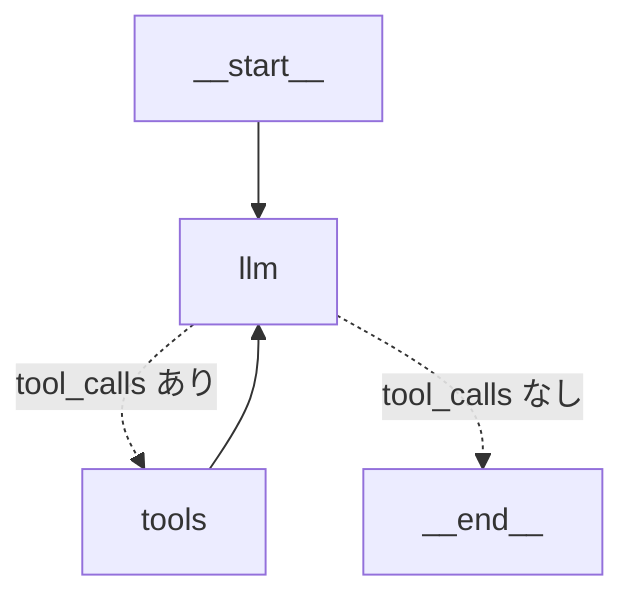

# LangGraph コンポーネント手組み ReAct Agent ガイド

## はじめに

`create_agent()` や `create_react_agent()` を使うと、数行で ReAct エージェントが作れます。しかし「中で何が起きているか」がブラックボックスです。

このガイドでは、LangGraph の基本コンポーネントを自分で組み立てて ReAct エージェントを構築し、**内部の仕組みを完全に理解する**ことを目指します。

---

## 1. LangGraph の5つの基本コンポーネント

```
┌──────────────────────────────────────────────────────┐
│                  StateGraph（グラフ）                  │
│                                                       │
│  ┌─────────┐   エッジ    ┌─────────┐                │
│  │ ノードA  │──────────→│ ノードB  │                │
│  └─────────┘            └─────────┘                │
│       ↑                      │                       │
│       │               条件付きエッジ                  │
│       │              ┌───┴───┐                      │
│       │              ▼       ▼                       │
│       │         ┌──────┐  [END]                     │
│       └─────────│ノードC│                            │
│                 └──────┘                             │
│                                                       │
│  ← すべてのノードが State を読み書きする →             │
│                                                       │
└──────────────────────────────────────────────────────┘
```

### ① State（ステート）

グラフ全体で共有される**データの入れ物**。すべてのノードは State を受け取り、更新した State を返します。

```python
from typing import Annotated
from typing_extensions import TypedDict
from langgraph.graph.message import add_messages

class AgentState(TypedDict):
    messages: Annotated[list, add_messages]
```

ポイント:

- `TypedDict` で定義する（型安全）
- `Annotated[list, add_messages]` は「上書きではなく追記」を意味する
- ノードが `{"messages": [new_msg]}` を返すと、既存リストに **append** される

`add_messages` がない場合（普通の `list`）は、返すたびにリストが丸ごと上書きされます。会話履歴が消えてしまうので、messages には必ず `add_messages` を付けます。

### ② Node（ノード）

**処理の単位**。Python の関数として定義します。State を受け取り、更新された State（の差分）を返します。

```python
def llm_node(state: AgentState):
    """LLM を呼び出すノード"""
    response = llm.invoke(state["messages"])
    return {"messages": [response]}    # ← messages に追記される
```

ノードは何でもできます。LLM 呼び出し、ツール実行、API コール、データ変換など。

### ③ Edge（通常エッジ）

ノード間を**固定的に接続**します。A の処理が終わったら**必ず** B に進む。

```python
graph_builder.add_edge("tools", "llm")    # ツール実行後は必ず LLM へ
graph_builder.add_edge(START, "llm")       # 開始時は必ず LLM から
```

### ④ Conditional Edge（条件付きエッジ）

条件に応じて**次のノードを動的に選ぶ**。ReAct パターンの核心です。

```python
graph_builder.add_conditional_edges(
    "llm",              # 分岐元のノード
    tools_condition,    # 分岐条件を判定する関数
    {
        "tools": "tools",    # tool_calls あり → ツールノードへ
        "__end__": END,       # tool_calls なし → 終了
    },
)
```

`tools_condition` は LangGraph が提供するヘルパー関数で、最後の AI メッセージに `tool_calls` が含まれているかをチェックします。自分で条件関数を書くこともできます:

```python
def should_continue(state: AgentState) -> str:
    """LLM の応答に tool_calls があるかチェックする"""
    last_message = state["messages"][-1]
    if hasattr(last_message, "tool_calls") and last_message.tool_calls:
        return "tools"       # ツールノードへ
    else:
        return "__end__"     # 終了
```

### ⑤ START / END

グラフの開始点と終了点を示す特別なノード。

```python
from langgraph.graph import START, END

graph_builder.add_edge(START, "llm")      # 開始 → LLM ノード
# 条件付きエッジで "__end__": END        # 条件を満たしたら終了
```

---

## 2. ReAct エージェントのグラフ構造

### 全体像

```
[START]
   │
   ▼
┌──────────┐
│ LLMノード │◄──────────────────┐
│          │                    │
│ ・会話履歴を受け取る           │
│ ・次の行動を決定              │
│ ・tool_call or 最終回答       │
└────┬─────┘                    │
     │                          │
     ▼                          │
《条件付きエッジ》               │
 tool_calls がある？            │
     │                          │
  Yes │    No                   │
     │     │                    │
     ▼     ▼                    │
┌──────┐  [END]                │
│ツール│                        │
│ノード│  ・ツールを実行         │
│      │  ・結果を State に追加  │
└──┬───┘                        │
   │                            │
   └────────────────────────────┘
         通常エッジ（必ず LLM に戻る）
```

### 実行フローの具体例

質問: 「2026/4/1ドジャーズの先発投手は？」

```
=== ステップ 1 ===
  ノード: START → llm
  State:  messages = [HumanMessage("2026/4/1ドジャーズの先発投手は？")]

  LLM の応答: tool_calls = [web_search(query="2026年4月1日 ドジャーズ 先発投手")]

=== 条件付きエッジ ===
  tool_calls あり → "tools" ノードへ

=== ステップ 2 ===
  ノード: tools
  State:  messages = [
            HumanMessage("2026/4/1ドジャーズの先発投手は？"),
            AIMessage(tool_calls=[...]),
          ]

  ツール実行: SerpAPI で検索 → 結果取得
  State に ToolMessage が追加される

=== 通常エッジ ===
  tools → llm（必ず LLM に戻る）

=== ステップ 3 ===
  ノード: llm
  State:  messages = [
            HumanMessage("2026/4/1ドジャーズの先発投手は？"),
            AIMessage(tool_calls=[...]),
            ToolMessage("検索結果: ..."),
          ]

  LLM の応答: "2026年4月1日のドジャーズの先発投手は○○です。"（tool_calls なし）

=== 条件付きエッジ ===
  tool_calls なし → END

=== 完了 ===
```

---

## 3. create_agent() との対応関係

`create_agent()` が内部で自動的にやっていることを、今回は手動で組み立てています。

| create_agent() が自動でやること | 手組みコードでの対応 |
|---|---|
| State の定義 | `class AgentState(TypedDict)` |
| LLM にツールをバインド | `llm.bind_tools(tools)` |
| LLM ノードの作成 | `def llm_node(state)` |
| ツールノードの作成 | `ToolNode(tools=tools)` |
| 条件付きエッジの設定 | `add_conditional_edges("llm", tools_condition, ...)` |
| ループの構築 | `add_edge("tools", "llm")` |
| コンパイル | `graph_builder.compile()` |
| system_prompt の適用 | `llm_node` 内で `SystemMessage` を追加 |

---

## 4. 手組みのメリット

### カスタムステートの追加

```python
class AgentState(TypedDict):
    messages: Annotated[list, add_messages]
    search_count: int           # ← 検索回数を追跡
    is_japanese: bool           # ← 日本語かどうかのフラグ
```

### カスタム条件分岐

```python
def should_continue(state: AgentState) -> str:
    # 検索回数が3回を超えたら強制終了
    if state.get("search_count", 0) >= 3:
        return "__end__"

    last_message = state["messages"][-1]
    if hasattr(last_message, "tool_calls") and last_message.tool_calls:
        return "tools"
    return "__end__"
```

### ノードの追加（前処理・後処理）

```python
# 入力を前処理するノード
def preprocess_node(state: AgentState):
    """ユーザー入力の言語を判定する"""
    user_msg = state["messages"][0].content
    is_ja = any(ord(c) > 0x3000 for c in user_msg)
    return {"is_japanese": is_ja}

# グラフに追加
graph_builder.add_node("preprocess", preprocess_node)
graph_builder.add_edge(START, "preprocess")
graph_builder.add_edge("preprocess", "llm")
```

### Human-in-the-Loop（人間の承認）

```python
def human_approval_node(state: AgentState):
    """ツール実行前に人間の承認を求める"""
    last_msg = state["messages"][-1]
    for tc in last_msg.tool_calls:
        print(f"ツール実行の承認: {tc['name']}({tc['args']})")
        approval = input("実行しますか？ (y/n): ")
        if approval.lower() != "y":
            return {"messages": [AIMessage(content="ユーザーがツール実行を拒否しました。")]}
    return {}  # 承認 → そのまま次のノードへ

# preprocess → llm → human_approval → tools → llm → ...
```

---

## 5. 必要なパッケージ

```bash
pip install langchain-core langchain-openai langchain-community \
            langgraph google-search-results
```

---

## 6. tools_condition を自作する場合

`tools_condition` は LangGraph 提供のヘルパーですが、中身はシンプルです:

```python
def my_tools_condition(state: AgentState) -> str:
    """最後の AI メッセージに tool_calls があるかチェック"""
    messages = state["messages"]
    last_message = messages[-1]

    # tool_calls があればツールノードへ、なければ終了
    if hasattr(last_message, "tool_calls") and last_message.tool_calls:
        return "tools"
    return "__end__"

# 使い方（tools_condition の代わりに my_tools_condition を渡す）
graph_builder.add_conditional_edges(
    "llm",
    my_tools_condition,
    {"tools": "tools", "__end__": END},
)
```

これを拡張すれば、「特定のツールだけ許可」「回数制限」「条件に応じて別のノードへ」など、柔軟な制御が可能になります。

---

## 7. グラフの可視化

コンパイルしたグラフは Mermaid 形式で可視化できます:

```python
# Jupyter Notebook の場合
from IPython.display import Image, display
display(Image(agent.get_graph(xray=True).draw_mermaid_png()))

# テキストで確認する場合
print(agent.get_graph().draw_mermaid())
```

出力される Mermaid 図:



---

## 8. まとめ: 新式 create_agent() vs 手組み

| 観点 | create_agent() | 手組み |
|---|---|---|
| コード量 | 少ない（5〜10行） | 多い（50〜100行） |
| カスタマイズ性 | ミドルウェアで拡張 | 完全に自由 |
| 学習効果 | ブラックボックス | 中身が完全に見える |
| 本番利用 | 推奨 | 高度なカスタマイズが必要な場合 |
| デバッグ | LangSmith 推奨 | ノードごとに print 可能 |

**初心者へのおすすめ学習順序:**

```
1. 手組み（このコード）で仕組みを理解する
     ↓
2. create_agent()（新式）で同じことが数行でできると実感する
     ↓
3. 必要に応じてミドルウェアやカスタムグラフを使い分ける
```
